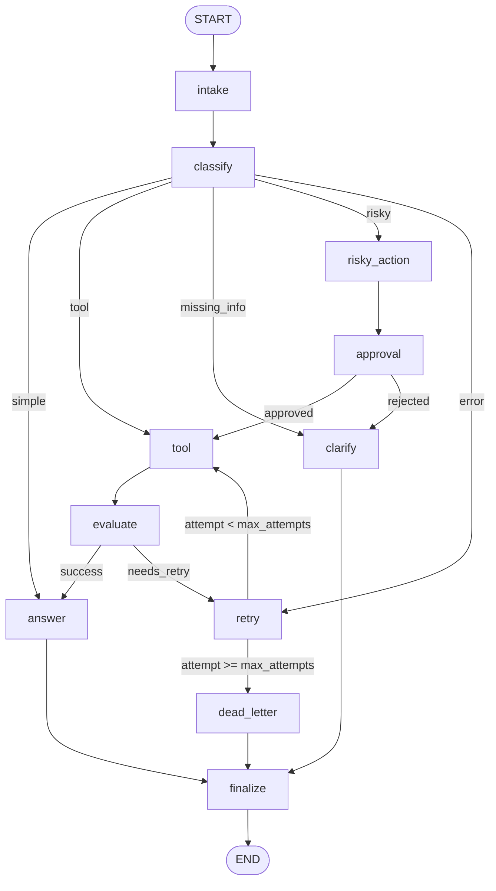

# Day 08 Lab — LangGraph Agentic Orchestration: Phân tích & Plan hoàn thành 100/100

> Repo: `VinUni-AI20k/phase2-track3-day8-langgraph-agent`  
> Mục tiêu lab: xây workflow LangGraph kiểu production cho support-ticket agent có state management, conditional routing, retry loop, human-in-the-loop approval, persistence và metrics.

---

## 1. Tóm tắt bài lab

Bài này không phải chỉ viết chatbot trả lời câu hỏi. Điểm chính là chứng minh bạn hiểu **agentic orchestration bằng LangGraph**:

- Có `AgentState` typed, gọn, serializable, có reducer đúng cho các field append-only.
- Có graph rõ ràng: `START -> intake -> classify -> route theo intent -> finalize -> END`.
- Có LLM thật trong ít nhất 2 node bắt buộc:
  - `classify_node`: dùng LLM structured output để phân loại route.
  - `answer_node`: dùng LLM sinh câu trả lời grounded theo context/tool results.
- Có tool path, retry path, dead-letter path, missing-info path, risky-action + approval path.
- Có checkpointer/persistence, metrics JSON, report markdown và bằng chứng demo.
- Không được hard-code theo `scenario_id` hoặc exact query vì bài có hidden scenarios.

---

## 2. Rubric chính thức và chiến lược lấy điểm tối đa

| Hạng mục | Điểm | Muốn đạt tối đa cần làm gì |
|---|---:|---|
| Architecture & state schema | 15 | `AgentState` typed, field đủ, reducer đúng, state không phình to, mọi node trả partial update không mutate input. |
| Graph construction & wiring | 15 | Đăng ký đủ 11 node, edge cố định + conditional edge đúng, graph compile được với checkpointer. |
| LLM integration | 15 | `classify_node` dùng `.with_structured_output()`, `answer_node` dùng LLM grounded response; `evaluate_node` dùng LLM-as-judge để lấy bonus/độ chắc. |
| Graph behavior | 20 | 7 sample scenarios route đúng, retry bounded, HITL approval path hoạt động, mọi route terminate ở `finalize -> END`. |
| Persistence & recovery | 10 | Checkpointer được wire, có `thread_id` mỗi run, có bằng chứng state history/crash-resume hoặc SQLite persistence. |
| Metrics & tests | 15 | `outputs/metrics.json` valid, success rate cao, scenario coverage đủ, `make test` pass, counts meaningful. |
| Report & demo | 10 | `reports/lab_report.md` có kiến trúc, metrics table, failure analysis, improvement ideas, bằng chứng extension. |

**Mục tiêu thực tế để chạm 100/100:**

1. Làm đầy đủ base requirement để đạt 85–90.
2. Làm ít nhất 1 extension rõ ràng, tốt nhất là **SQLite persistence + graph diagram Mermaid + LLM-as-judge evaluate_node**.
3. Thêm custom scenarios để tự test hidden cases.
4. Report phải có bằng chứng: metrics, log/state history, graph diagram, failure analysis.

---

## 3. File cần sửa trong repo

| File | Vai trò | Việc cần làm |
|---|---|---|
| `src/langgraph_agent_lab/state.py` | State schema | Thêm field: `evaluation_result`, `pending_question`, `proposed_action`, `approval`, có thể thêm `classification_reason`, `tool_query`, `history`. |
| `src/langgraph_agent_lab/nodes.py` | Logic các node | Implement 10 node TODO; `intake_node` đã có. |
| `src/langgraph_agent_lab/routing.py` | Conditional routing | Implement 4 hàm route đúng theo test. |
| `src/langgraph_agent_lab/graph.py` | Build StateGraph | Add đủ node, fixed edge, conditional edge, compile với checkpointer. |
| `src/langgraph_agent_lab/persistence.py` | Checkpointer | Giữ `memory`; thêm `sqlite` bằng `SqliteSaver`. |
| `src/langgraph_agent_lab/report.py` | Report | Render markdown report từ `MetricsReport`. |
| `src/langgraph_agent_lab/llm.py` | LLM helper | Đảm bảo `.env` được load hoặc biến môi trường được export. |
| `configs/lab.yaml` | Config run local | Có thể giữ `memory`; tạo thêm config SQLite nếu muốn evidence. |
| `reports/lab_report.md` | Bài nộp | Điền đủ kiến trúc, metrics, failure analysis, persistence evidence, extension. |
| `data/sample/scenarios.jsonl` | Local test | Có thể thêm custom scenarios, không xóa 7 sample gốc. |

---

## 4. Kiến trúc graph nên triển khai



Tên node trong graph nên khớp với routing test:

- `intake`
- `classify`
- `answer`
- `tool`
- `evaluate`
- `clarify`
- `risky_action`
- `approval`
- `retry`
- `dead_letter`
- `finalize`

---

## 5. Thiết kế state schema

Trong `AgentState`, giữ state gọn nhưng đủ cho routing/report:

```python
class AgentState(TypedDict, total=False):
    thread_id: str
    scenario_id: str
    query: str
    route: str
    risk_level: str
    attempt: int
    max_attempts: int
    final_answer: str | None

    evaluation_result: str
    pending_question: str | None
    proposed_action: str | None
    approval: dict[str, Any] | None
    classification_reason: str | None

    messages: Annotated[list[str], add]
    tool_results: Annotated[list[str], add]
    errors: Annotated[list[str], add]
    events: Annotated[list[dict[str, Any]], add]
```

Reducer rule:

| Field | Reducer | Lý do |
|---|---|---|
| `messages` | append | Audit trace. |
| `tool_results` | append | Giữ lịch sử retry/tool calls. |
| `errors` | append | Đếm lỗi/retry/dead-letter. |
| `events` | append | Metrics tính nodes visited, retry, approval. |
| `route`, `risk_level`, `attempt`, `final_answer`, `evaluation_result`, `approval` | overwrite | Chỉ cần trạng thái mới nhất. |

---

## 6. Plan triển khai theo từng phase

### Phase 0 — Setup môi trường

Linux/macOS:

```bash
python -m venv .venv
source .venv/bin/activate
pip install -e '.[dev,google,sqlite]'
cp .env.example .env
```

Windows PowerShell:

```powershell
py -m venv .venv
.\.venv\Scripts\Activate.ps1
py -m pip install -e ".[dev,google,sqlite]"
copy .env.example .env
```

Trong `.env`, chọn 1 provider:

```env
GEMINI_API_KEY=your_key
LLM_MODEL=gemini-2.5-flash
CHECKPOINTER=memory
```

Lưu ý quan trọng: `llm.py` đang đọc bằng `os.getenv(...)`. Nếu `.env` không tự load, cần thêm `python-dotenv` và gọi `load_dotenv()` trong `llm.py`, hoặc export biến môi trường trực tiếp trong terminal.

---

### Phase 1 — Implement `routing.py` trước để pass unit test nhanh

Logic cần khớp test:

```python
def route_after_classify(state):
    return {
        "simple": "answer",
        "tool": "tool",
        "missing_info": "clarify",
        "risky": "risky_action",
        "error": "retry",
    }.get(str(state.get("route", "")), "answer")


def route_after_evaluate(state):
    return "retry" if state.get("evaluation_result") == "needs_retry" else "answer"


def route_after_retry(state):
    return "tool" if int(state.get("attempt", 0)) < int(state.get("max_attempts", 3)) else "dead_letter"


def route_after_approval(state):
    approval = state.get("approval") or {}
    return "tool" if approval.get("approved") is True else "clarify"
```

Chạy:

```bash
pytest tests/test_routing.py
```

---

### Phase 2 — Implement state fields

Trong `state.py`:

1. Thêm field còn thiếu.
2. Update `initial_state()` để có default rõ ràng:
   - `evaluation_result`: `""`
   - `pending_question`: `None`
   - `proposed_action`: `None`
   - `approval`: `None`
   - `classification_reason`: `None`
3. Không thêm object không serializable vào state.

Chạy:

```bash
pytest tests/test_state.py
```

---

### Phase 3 — Implement LLM structured classification

Trong `nodes.py`, tạo Pydantic model:

```python
from typing import Literal
from pydantic import BaseModel, Field

class ClassificationResult(BaseModel):
    route: Literal["simple", "tool", "missing_info", "risky", "error"]
    risk_level: Literal["low", "medium", "high"] = "low"
    reason: str = Field(default="")
```

Prompt classification nên có policy tổng quát, không match exact scenario:

- `risky`: refund, delete, cancel, send email, thay đổi dữ liệu, hành động side-effect.
- `tool`: lookup/search/status/tracking/order/account info.
- `missing_info`: câu quá mơ hồ, thiếu đối tượng/hành động/context.
- `error`: timeout, crash, unavailable, unrecoverable/system failure.
- `simple`: hướng dẫn chung, reset password, FAQ.
- Priority: `risky > tool > missing_info > error > simple`.

Node trả về:

```python
{
  "route": result.route,
  "risk_level": "high" if result.route == "risky" else result.risk_level,
  "classification_reason": result.reason,
  "events": [make_event("classify", "completed", "route selected", route=result.route)],
}
```

Hidden grading sẽ phạt nếu bạn hard-code kiểu `if scenario_id == "S01"` hoặc match exact query.

---

### Phase 4 — Implement các node xử lý flow

#### `tool_node`

Yêu cầu:

- Đọc `route`, `query`, `attempt`.
- Nếu `route == "error"` và `attempt < 2`, trả result chứa `ERROR` để test retry.
- Nếu thành công, trả mock result có ý nghĩa.
- Với risky path, chỉ chạy tool sau approval.

Gợi ý behavior:

```python
if route == "error" and attempt < 2:
    result = f"ERROR: transient failure on attempt {attempt + 1}"
elif route == "tool":
    result = f"Order lookup result for query: {query}. Status: processing."
elif route == "risky":
    result = f"Approved risky action prepared/executed safely for: {query}."
else:
    result = f"Tool completed for: {query}."
```

#### `evaluate_node`

Base:

```python
latest = state.get("tool_results", [""])[-1]
evaluation_result = "needs_retry" if "ERROR" in latest.upper() else "success"
```

Để tăng điểm:

- Dùng LLM-as-judge với structured output.
- Nhưng vẫn nên fallback heuristic nếu LLM lỗi để graph không chết.

#### `answer_node`

Bắt buộc dùng LLM thật. Prompt nên ép grounded:

- Dựa vào `query`.
- Dựa vào `tool_results` nếu có.
- Dựa vào `approval` nếu có.
- Không bịa thông tin ngoài context.
- Nếu tool không có dữ liệu đủ, nói rõ hạn chế.

#### `ask_clarification_node`

Không gọi tool, không hallucinate. Trả `pending_question` và `final_answer` giống câu hỏi cần bổ sung thông tin.

Ví dụ: `Could you share which account/order/request you want help with and what outcome you expect?`

#### `risky_action_node`

Tạo `proposed_action` nêu:

- Hành động rủi ro là gì.
- Vì sao cần approval.
- Dữ liệu nào sẽ bị ảnh hưởng.

#### `approval_node`

Base requirement: mock approval để CI không treo:

```python
approval = {"approved": True, "reviewer": "mock-reviewer", "comment": "Approved for lab scenario"}
```

Extension:

- Nếu `LANGGRAPH_INTERRUPT=true`, dùng `interrupt()` để human approve/reject thật.
- Default vẫn phải mock approval để test tự động chạy được.

#### `retry_or_fallback_node`

- Tăng `attempt` thêm 1.
- Append error.
- Log event `node="retry"`.

#### `dead_letter_node`

- Set `final_answer` giải thích không thể hoàn thành sau retry limit.
- Append error/event.
- Không loop tiếp.

#### `finalize_node`

- Luôn append event `node="finalize"`.
- Không thay đổi route.

---

### Phase 5 — Build graph trong `graph.py`

Pseudo-code:

```python
def build_graph(checkpointer=None):
    from langgraph.graph import END, START, StateGraph
    from .nodes import (
        intake_node, classify_node, tool_node, evaluate_node, answer_node,
        ask_clarification_node, risky_action_node, approval_node,
        retry_or_fallback_node, dead_letter_node, finalize_node,
    )
    from .routing import (
        route_after_classify, route_after_evaluate,
        route_after_retry, route_after_approval,
    )

    graph = StateGraph(AgentState)

    graph.add_node("intake", intake_node)
    graph.add_node("classify", classify_node)
    graph.add_node("tool", tool_node)
    graph.add_node("evaluate", evaluate_node)
    graph.add_node("answer", answer_node)
    graph.add_node("clarify", ask_clarification_node)
    graph.add_node("risky_action", risky_action_node)
    graph.add_node("approval", approval_node)
    graph.add_node("retry", retry_or_fallback_node)
    graph.add_node("dead_letter", dead_letter_node)
    graph.add_node("finalize", finalize_node)

    graph.add_edge(START, "intake")
    graph.add_edge("intake", "classify")

    graph.add_conditional_edges("classify", route_after_classify, {
        "answer": "answer",
        "tool": "tool",
        "clarify": "clarify",
        "risky_action": "risky_action",
        "retry": "retry",
    })

    graph.add_edge("tool", "evaluate")
    graph.add_conditional_edges("evaluate", route_after_evaluate, {
        "retry": "retry",
        "answer": "answer",
    })

    graph.add_edge("risky_action", "approval")
    graph.add_conditional_edges("approval", route_after_approval, {
        "tool": "tool",
        "clarify": "clarify",
    })

    graph.add_conditional_edges("retry", route_after_retry, {
        "tool": "tool",
        "dead_letter": "dead_letter",
    })

    graph.add_edge("answer", "finalize")
    graph.add_edge("clarify", "finalize")
    graph.add_edge("dead_letter", "finalize")
    graph.add_edge("finalize", END)

    return graph.compile(checkpointer=checkpointer)
```

Chạy:

```bash
pytest tests/test_graph_smoke.py
```

---

### Phase 6 — Persistence / recovery để lấy đủ 10 điểm

Base CLI đã truyền `thread_id` vào `graph.invoke()` qua config. Bạn cần làm rõ checkpointer.

Trong `persistence.py`, giữ memory và thêm SQLite:

```python
if kind == "sqlite":
    import sqlite3
    from langgraph.checkpoint.sqlite import SqliteSaver

    db_path = database_url or "outputs/checkpoints.sqlite"
    conn = sqlite3.connect(db_path, check_same_thread=False)
    conn.execute("PRAGMA journal_mode=WAL;")
    return SqliteSaver(conn=conn)
```

Tạo `configs/sqlite.yaml`:

```yaml
scenarios_path: data/sample/scenarios.jsonl
checkpointer: sqlite
database_url: outputs/checkpoints.sqlite
report_path: reports/lab_report.md
```

Chạy:

```bash
python -m langgraph_agent_lab.cli run-scenarios --config configs/sqlite.yaml --output outputs/metrics.json
```

Bằng chứng đưa vào report:

- `outputs/checkpoints.sqlite` tồn tại.
- Mỗi scenario có `thread_id = thread-<scenario_id>`.
- Có thể lấy state history bằng API graph/checkpointer nếu bạn implement demo thêm.
- Hoặc log screenshot/terminal output sau khi run SQLite.

---

### Phase 7 — Metrics & report

`metric_from_state()` đã có sẵn, nên focus vào `report.py`.

`render_report(metrics)` cần có:

1. Metrics summary table:
   - total scenarios
   - success rate
   - avg nodes visited
   - total retries
   - total interrupts
   - resume success
2. Per-scenario table:
   - scenario id
   - expected route
   - actual route
   - success
   - retries
   - interrupts
   - approval observed
   - errors
3. Architecture explanation.
4. State schema explanation.
5. Failure analysis ít nhất 2 case:
   - transient tool failure -> retry -> success/dead-letter.
   - risky action without approval -> phải chặn bằng HITL.
6. Persistence evidence.
7. Extension work.
8. Improvement plan.

Chạy:

```bash
make run-scenarios
make grade-local
```

---

### Phase 8 — Test hidden scenarios trước khi nộp

Thêm file `data/sample/scenarios_extra.jsonl` hoặc thêm tạm vào `scenarios.jsonl` các case tổng quát:

```jsonl
{"id":"S08_cancel","query":"Cancel this customer's subscription and email them immediately","expected_route":"risky","requires_approval":true,"tags":["custom","risky"]}
{"id":"S09_tracking","query":"Can you check tracking for shipment A100?","expected_route":"tool","requires_approval":false,"tags":["custom","tool"]}
{"id":"S10_vague","query":"Help me with that thing","expected_route":"missing_info","requires_approval":false,"tags":["custom","missing"]}
{"id":"S11_outage","query":"The payment service is unavailable and keeps crashing","expected_route":"error","requires_approval":false,"should_retry":true,"tags":["custom","error"]}
{"id":"S12_faq","query":"Where can I change my notification settings?","expected_route":"simple","requires_approval":false,"tags":["custom","simple"]}
```

Không nên nộp nếu chỉ pass 7 sample nhưng fail custom cases.

---

## 7. Thứ tự làm nhanh nhất để không bị lạc

1. `routing.py` pass trước.
2. `state.py` thêm field.
3. `nodes.py` implement node đơn giản nhưng đúng behavior.
4. `graph.py` wire đủ graph.
5. Chạy `pytest`.
6. Setup LLM key, chạy smoke tests.
7. Chạy `make run-scenarios`.
8. Kiểm tra `outputs/metrics.json`: success rate phải 1.0 với sample.
9. Implement SQLite persistence.
10. Implement `report.py`, generate `reports/lab_report.md`.
11. Thêm Mermaid graph + extension evidence vào report.
12. Chạy `make lint`, `make typecheck`, `make grade-local`.
13. Commit code + metrics + report.

---

## 8. Lệnh kiểm tra cuối cùng

Linux/macOS:

```bash
pip install -e '.[dev,google,sqlite]'
pytest
ruff check src tests
mypy src
make run-scenarios
make grade-local
```

Windows PowerShell:

```powershell
py -m pip install -e ".[dev,google,sqlite]"
pytest
ruff check src tests
mypy src
python -m langgraph_agent_lab.cli run-scenarios --config configs/lab.yaml --output outputs/metrics.json
python -m langgraph_agent_lab.cli validate-metrics --metrics outputs/metrics.json
```

Kỳ vọng:

- `pytest` pass.
- `ruff` pass hoặc chỉ còn lỗi nhỏ đã fix.
- `mypy` pass.
- `outputs/metrics.json` valid.
- `success_rate` bằng `1.0` với sample scenarios.
- `reports/lab_report.md` có đầy đủ nội dung.

---

## 9. Prompt ngắn cho Codex

```text
Đọc README và toàn bộ repo phase2-track3-day8-langgraph-agent. Implement đầy đủ TODO(student) để đạt rubric 100/100, không hard-code scenario_id hoặc exact query. Làm theo thứ tự: state.py thêm field serializable và reducer đúng; routing.py implement 4 route functions đúng test; nodes.py implement classify_node bằng LLM structured output, answer_node bằng LLM grounded response, evaluate_node có LLM-as-judge fallback heuristic, tool retry simulation, HITL mock approval mặc định, dead_letter/finalize đầy đủ events; graph.py wire đủ 11 nodes với conditional edges và mọi path về finalize -> END; persistence.py thêm SQLite checkpointer bằng SqliteSaver(conn=sqlite3.connect(...)); report.py render lab_report.md từ metrics. Sau đó chạy pytest, ruff, mypy, make run-scenarios, make grade-local. Nếu lỗi do .env chưa load thì thêm python-dotenv/load_dotenv hoặc hướng dẫn export env. Giữ code sạch, typed, không mutate input state, không sửa các phần không liên quan.
```

---

## 10. Tiêu chuẩn nộp bài

Nộp kèm:

- Code đã implement trong `src/langgraph_agent_lab/*`.
- `outputs/metrics.json` sau khi chạy scenario.
- `reports/lab_report.md` hoàn chỉnh.
- Bằng chứng extension: SQLite checkpoint file/log, graph Mermaid diagram, hoặc HITL interrupt demo.
- Commit rõ ràng, không chứa API key trong `.env`.
