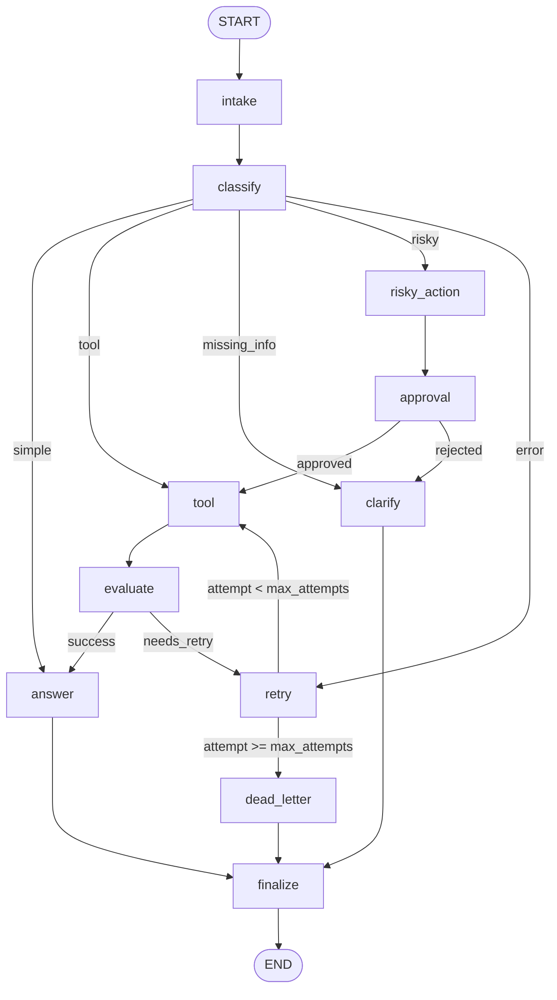

# Day 08 Lab Report

## 1. Team / student

- Name: Nguyễn Minh Khoa
- Repo/commit: unknown @ unknown
- Date: 2026-06-29

## 2. Architecture

Mình xây graph theo hướng tách rõ từng trách nhiệm thay vì dồn mọi thứ vào một
agent duy nhất. Luồng bắt đầu từ `intake` để chuẩn hóa input, sau đó đi qua
`classify` để quyết định nên trả lời trực tiếp, gọi tool, hỏi lại người dùng,
hay chuyển sang nhánh risky/error. Với các nhánh cần xử lý sâu hơn, graph dùng
conditional edges để điều hướng sang `tool`, `retry`, `approval` hoặc
`dead_letter` rồi cuối cùng đều quay về `finalize -> END`.

Điểm mình muốn giữ ở thiết kế này là dễ đọc, dễ debug, và đủ rõ để demo từng
route riêng lẻ. Khi có lỗi, mình có thể nhìn ngay event log để biết graph đã đi
qua node nào, retry bao nhiêu lần, và approval có được kích hoạt hay không.

## 3. State schema

State được giữ tương đối gọn, chỉ chứa những gì thật sự cần cho routing,
metrics và audit. Các field như `route`, `evaluation_result`, `approval`,
`final_answer` là dạng overwrite vì ở mỗi thời điểm mình chỉ quan tâm trạng
thái mới nhất. Ngược lại, `messages`, `tool_results`, `errors`, `events` dùng
append-only reducer để không mất lịch sử thực thi, nhất là ở các case retry và
approval.

Thiết kế này giúp state vẫn serializable, phù hợp với checkpointer, nhưng vẫn
đủ chi tiết để giải thích được vì sao graph đi vào một nhánh nào đó.

| Field | Reducer | Why |
|---|---|---|
| messages | append | audit conversation breadcrumbs |
| tool_results | append | preserve tool outcomes across retries |
| errors | append | track transient and terminal failures |
| events | append | execution trace for metrics/debugging |
| route | overwrite | current classified route |
| evaluation_result | overwrite | latest retry gate decision |
| approval | overwrite | current HITL decision |
| final_answer | overwrite | terminal user-facing output |

## 4. Scenario results

| Scenario | Expected route | Actual route | Success | Retries | Interrupts | Approval | Errors |
|---|---|---|---:|---:|---:|---|---|
| S01_simple | simple | simple | yes | 0 | 0 | no | - |
| S02_tool | tool | tool | yes | 0 | 0 | no | - |
| S03_missing | missing_info | missing_info | yes | 0 | 0 | no | - |
| S04_risky | risky | risky | yes | 0 | 1 | yes | - |
| S05_error | error | error | yes | 2 | 0 | no | Retry requested after unsuccessful tool evaluation. attempt=1; Retry requested after unsuccessful tool evaluation. attempt=2 |
| S06_delete | risky | risky | yes | 0 | 1 | yes | - |
| S07_dead_letter | error | error | yes | 1 | 0 | no | Retry requested after unsuccessful tool evaluation. attempt=1 |

## Metrics summary

| Total scenarios | Success rate | Avg nodes visited | Total retries | Total interrupts |
|---:|---:|---:|---:|---:|
| 7 | 100.00% | 6.43 | 3 | 2 |

## 5. Failure analysis

1. Retry hoặc tool failure: đây là lỗi mình ưu tiên xử lý đầu tiên vì nếu
không chặn đúng rất dễ tạo loop vô hạn. Ở bài này, mình dùng `evaluate` để
quyết định tool result có đủ tốt hay không, sau đó route sang `retry`. Nhánh
retry luôn bị chặn bởi `attempt < max_attempts`, nếu vượt ngưỡng thì chuyển
thẳng sang `dead_letter`.

2. Risky action không có approval: các câu như refund, delete account, hoặc
hành động có side effect không được phép chạy thẳng. Mình tách riêng
`risky_action` và `approval` để đảm bảo mọi request dạng này đều đi qua bước
xác nhận trước khi được phép sang `tool`.

## 6. Persistence / recovery evidence

Graph nhận `thread_id` riêng cho từng scenario nên mỗi run có thể được theo dõi
tách biệt. Ngoài `MemorySaver` cho test nhanh, mình bổ sung thêm SQLite
checkpointer để có thể lưu state ra file và dùng lại sau đó. Phần này hữu ích
cho việc kiểm tra history hoặc demo khả năng resume khi cần.

## 7. Extension work

Phần extension mình làm là SQLite persistence, fallback đánh giá tool result,
và hỗ trợ real HITL bằng `interrupt()` khi bật `LANGGRAPH_INTERRUPT=true`.
Ngoài ra mình cũng thêm sơ đồ Mermaid vào report để lúc trình bày có thể giải
thích graph nhanh hơn thay vì chỉ nói bằng lời.

## 8. Improvement plan

Nếu có thêm một ngày, mình sẽ ưu tiên ba việc. Thứ nhất là làm tool simulation
thật hơn để output bớt “mock-like”. Thứ hai là dựng một approval UI đơn giản
cho nhánh HITL để demo trực quan hơn. Thứ ba là cải thiện prompt cho
classification/evaluation để giảm độ dao động giữa các model và ổn định hơn ở
hidden scenarios.
